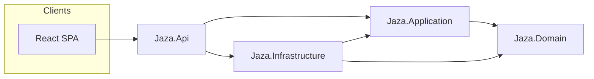

# Architecture — Jaza Venus

Jaza Venus is a **warehouse management** web application: master data, inbound (purchase orders, GRNs), stock, outbound (sales orders, delivery orders), invoicing, and reports. It replaces a legacy VB.NET + SQL Server system using **PostgreSQL 17** as the database.

## Logical layers (.NET backend)

Solutions follow **clean-ish** layering with dependency direction inward:

| Project | Responsibility |
|---------|----------------|
| **Jaza.Domain** | Entities, enums, domain invariants — no infra references. |
| **Jaza.Application** | Use cases, DTOs, validators, interfaces (`ICurrentUser`, repositories). |
| **Jaza.Infrastructure** | EF Core (`AppDbContext`), Identity (`AppUser` / roles), persistence, external services. |
| **Jaza.Api** | ASP.NET Core host: controllers, middleware (security headers, antiforgery), health checks, static files + SPA fallback. |
| **Jaza.Migration** | One-off **ETL** console: legacy database → new schema (not part of the running API). |

## Runtime pipeline (API)

1. **Forwarded headers** when behind Cloudflare/Caddy.
2. **Exception handler** + Problem Details.
3. **Security headers** (`UseJazaSecurityHeaders`).
4. **Default files + static files** — production serves the built React app from `wwwroot`.
5. **Routing** → **global rate limiting** → **CORS** (credentials + allowed origins).
6. **Cookie authentication** + **authorization** (`FallbackPolicy` = authenticated users only unless `[AllowAnonymous]`).
7. **Controllers**; **health** at `/health`; **fallback** to `index.html` for client-side routing.

## Authentication and authorization

- **ASP.NET Core Identity** with **cookie** sessions (`Cookie` section in `appsettings*.json`).
- **CSRF**: antiforgery token in `X-XSRF-TOKEN` header; cookie name `jaza.xsrf`. The SPA should call `GET /api/auth/antiforgery` before login and send the token on mutating requests.
- **Roles**: `SuperAdmin`, `Admin`, `Operator` (see `Jaza.Application.Common.Roles`).
- **Policies**: `RequireSuperAdmin`, `RequireAdmin`, `RequireOperator` (SuperAdmin may do everything lower roles can).
- **MFA**: TOTP for SuperAdmin in production by default (`Auth:RequireSuperAdminMfa`); see [security.md](security.md).

JWT Bearer packages are **not** used — the interactive UI is cookie-based.

## Frontend (React)

- **React 19**, **React Router 7**, **TanStack Query**, **Tailwind CSS 4**, **shadcn/Radix** primitives.
- **Module tree**: `frontend/src/app/modules.tsx` is the single source for sidebar, router, breadcrumbs, and hub tiles. Labels mirror the legacy app for familiarity.
- **Production build**: `dotnet publish` on `Jaza.Api` can run `npm ci` + `npm run build` with `JAZA_VITE_OUTDIR` pointing at `wwwroot` (see `Jaza.Api.csproj`).

## Data and jobs

- **PostgreSQL 17** via EF Core (Npgsql); migrations applied at startup (`DbInitializer`).
- **Operational backups**: [runbook.md](runbook.md) describes encryption, retention, and off-site copies. Scheduling is **outside** this repository today (use SQL Agent, `cron`, or similar). An in-process scheduled job is not registered in the API codebase at present.

## Observability

- **Serilog** (console + rolling file by default); optional **Seq** sink from configuration.
- **Health checks**: SQL connectivity exposed at `/health`.

## Related documents

- [http-api.md](http-api.md) — route catalogue.
- [development.md](development.md) — how to run and test locally.
- [security.md](security.md) — detailed controls.
- [runbook.md](runbook.md) — production topology (Cloudflare → Caddy → API → PostgreSQL).
