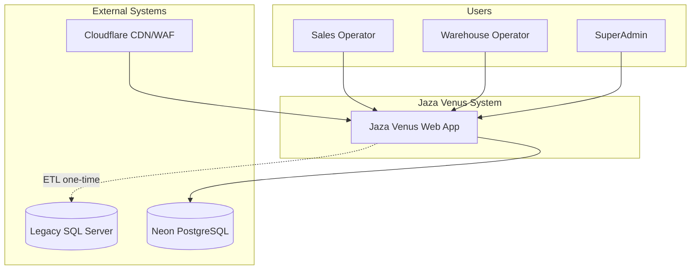
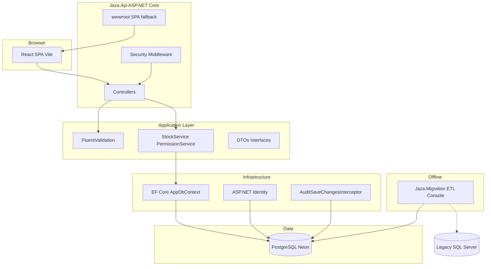
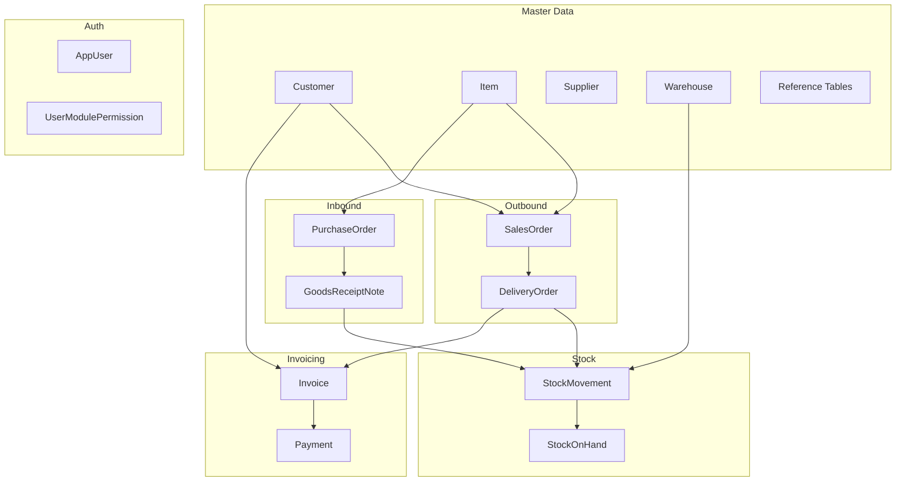
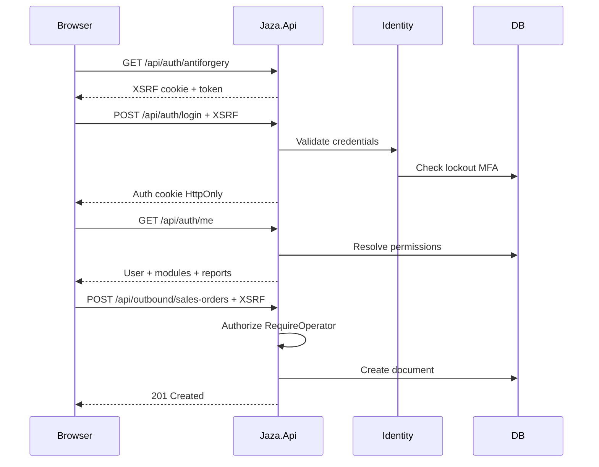
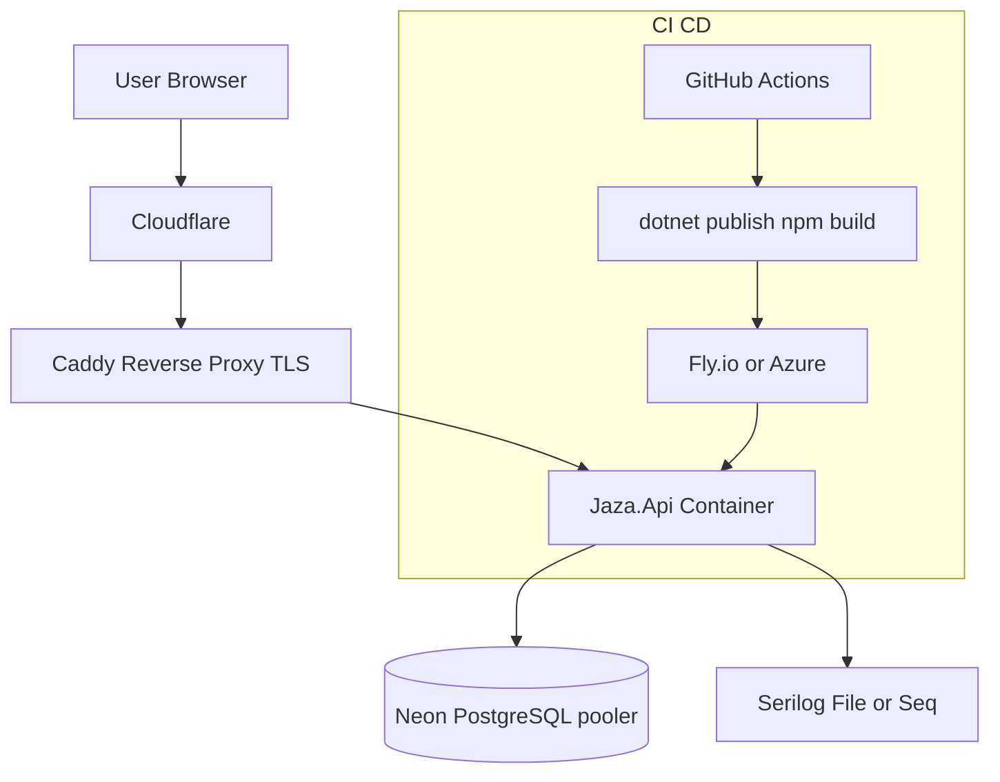
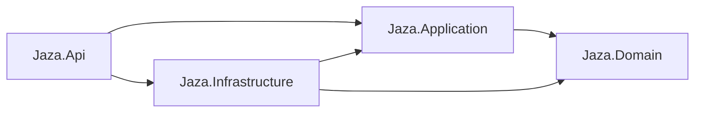

# Architecture Diagrams — Jaza Venus

Extends [architecture.md](../architecture.md) with C4, domain, sequence, and deployment views.

---

## 1. C4 Context

---

## 2. C4 Container

---

## 3. Domain module map

---

## 4. Request / auth sequence

---

## 5. Deployment topology

| Environment | Frontend | Backend | Database |
|-------------|----------|---------|----------|
| Local dev | Vite :5173 | Kestrel :5000 | Docker PostgreSQL or Neon |
| Production | Served from wwwroot | Fly.io / Azure App Service | Neon serverless PG |

See [deployment-hosting.md](../deployment-hosting.md), [runbook.md](../runbook.md).

---

## 6. Layer dependency rules

- **Domain:** entities, enums, no infrastructure references.
- **Application:** DTOs, validators, interfaces.
- **Infrastructure:** EF, Identity, external services.
- **Api:** HTTP, middleware, DI composition root.

---

## Related

- [architecture.md](../architecture.md)
- [security.md](../security.md)
- [http-api.md](../http-api.md)
