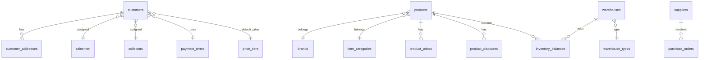
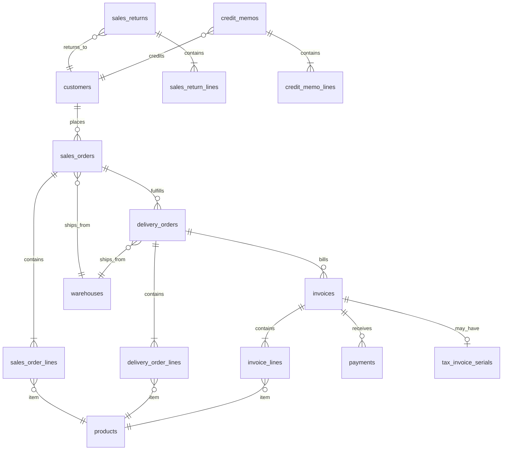
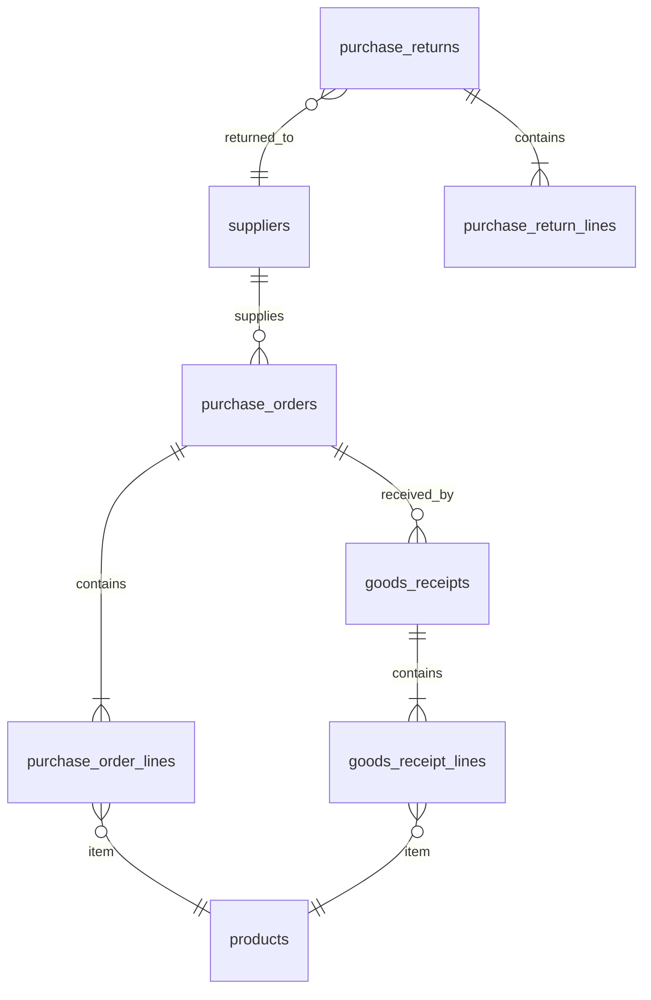
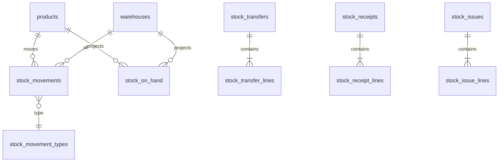
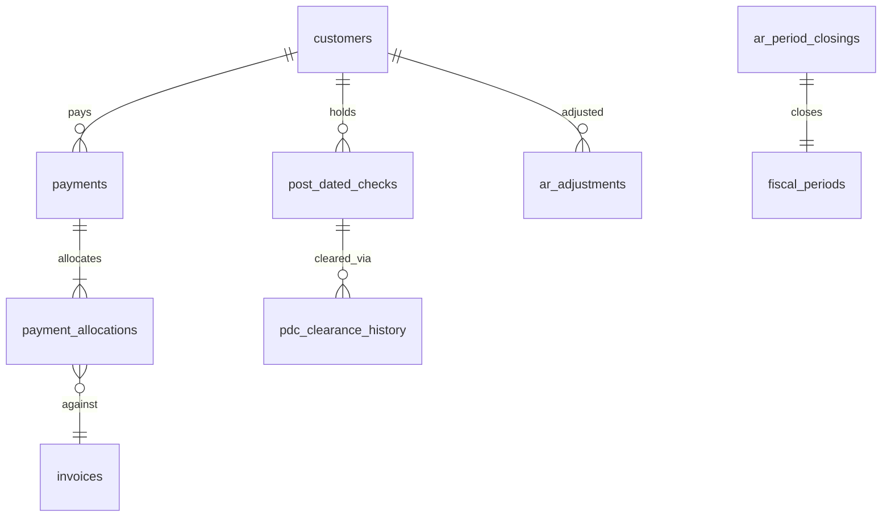
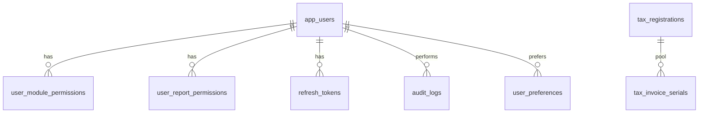

# Entity Relationship Diagram — Jaza Venus

Consolidated ERD of **target schema** (design doc + parity additions). Implemented entities shown solid; planned additions dashed.

---

## 1. Master data core

---

## 2. Sales document chain

*Dashed entities (`sales_returns`, `credit_memos`, `tax_invoice_serials`) are planned — not yet in EF.*

---

## 3. Purchase chain

---

## 4. Stock ledger

---

## 5. A/R and payments

---

## 6. Auth and audit

---

## 7. Key relationships summary

| From | To | Cardinality | FK field |
|------|-----|-------------|----------|
| SalesOrderLine | SalesOrder | N:1 | order_id |
| DeliveryOrderLine | SalesOrderLine | N:1 | base_entry, base_line |
| InvoiceLine | DeliveryOrderLine | N:1 | base_entry, base_line |
| PaymentAllocation | Invoice | N:1 | invoice_id |
| StockMovement | Product, Warehouse | N:1 | product_id, warehouse_id |
| GoodsReceiptLine | PurchaseOrderLine | N:1 | base_entry, base_line |

---

## 8. Legacy → new naming quick reference

| Legacy | New table |
|--------|-----------|
| Order | sales_orders |
| Delivery | deliveries / delivery_orders |
| Invoice | invoices |
| Receipt | payments |
| Giro | post_dated_checks |
| Item | products |
| CustmrCode | customers.code |
| Inventory | inventory_balances + stock_movements |

Full mapping: [database-base-docs.md](database-base-docs.md) §4.

---

## Related

- [database-review.md](database-review.md)
- [schema-mapping.md](../schema-mapping.md)
