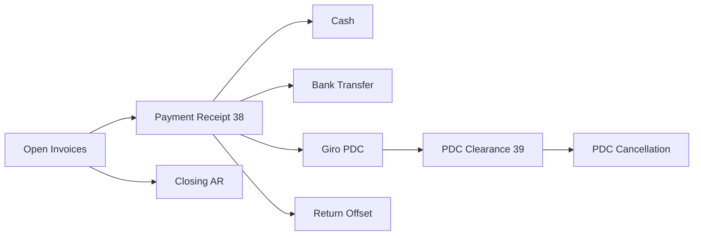
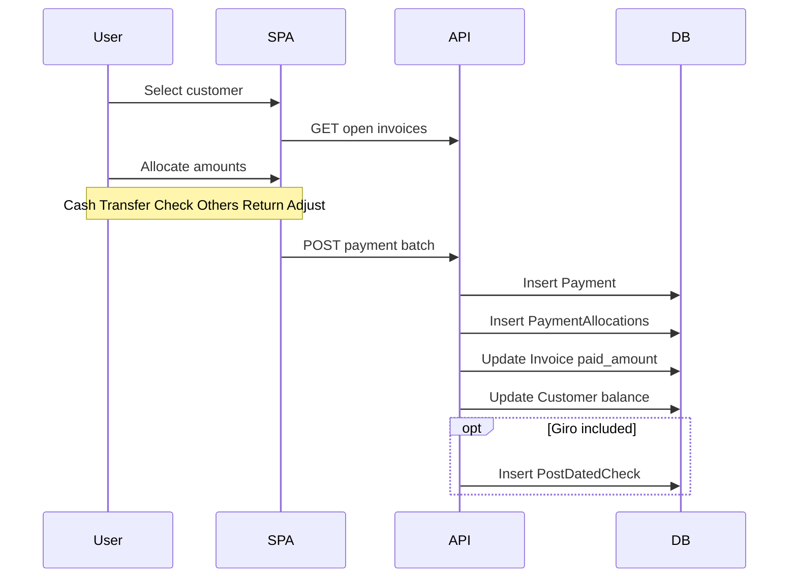
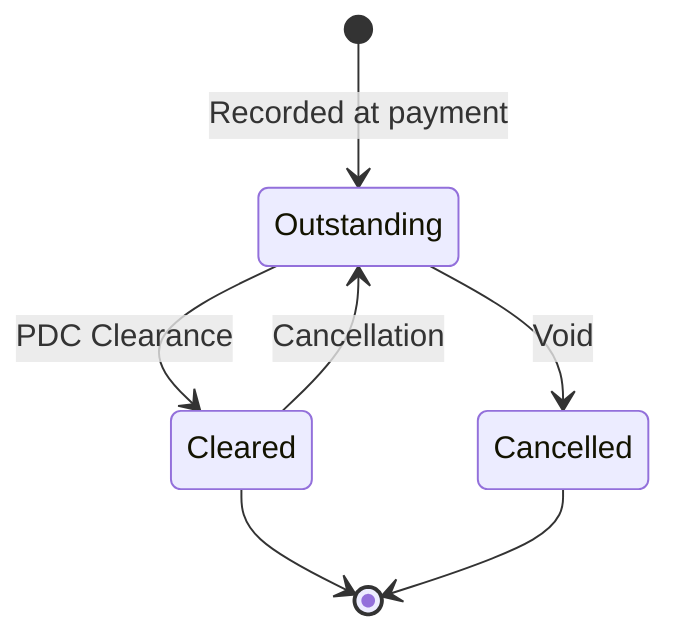

# A/R Flow — End to End

**Legacy reference:** `Jaza Venus Legacy Program/docs/06-flow-sales-ar.md`, `docs/business-flows/03-ar-transaction.md`

**New app routes:** `/ar/*`, `/system/closing-ar-entry`  
**Backend:** `InvoicingController` (partial)

---

## 1. Overview

Accounts receivable covers payment collection, post-dated cheques (PDC/Giro), and period closing.

---

## 2. Payment receipt sequence

---

## 3. Payment allocation types (legacy)

| Type | Field | Description |
|------|-------|-------------|
| Cash | cash_applied | Physical cash |
| Transfer | transfer_applied | Bank transfer |
| Check/Giro | check_applied | Post-dated cheque |
| Others | other_applied | Other methods |
| Return | return_applied | Sales return offset |
| Adjustment | adjust_applied | AR adjustment |

**Total payment** = sum of all types.

---

## 4. PDC / Giro lifecycle

---

## 5. Faktur Pajak (tax invoice serial)

For PKP customers at invoice post:

1. Select customer address with PKP code.
2. Allocate serial from `TaxRegistration` pool (`from_no` + `no_used`).
3. 8-digit padded serial → invoice `tax_serial`.
4. Log to audit; update `no_used` counter.

Credit notes use separate CN serial pool (`SeriFakturCN`).

---

## 6. Closing A/R

1. Select year/month.
2. Lock transactions for closed period.
3. Prevent back-dated payments.
4. Optional: recalculate all customer balances.

---

## 7. Implementation status

| Feature | Backend | Frontend |
|---------|---------|----------|
| Invoice-level payment | ✅ | ❌ |
| Batch payment receipt | ✅ schema (`payment_allocations`) | ❌ |
| Bank transfer transaction | ❌ | UI shell |
| PDC/Giro | ✅ schema | UI shell / Coming Soon |
| Faktur serial | ✅ schema | ❌ |
| Closing AR | ✅ schema | Coming Soon |
| Recalculate balance | ❌ | Coming Soon |

Persisted entities: [table-catalog](../../database/table-catalog.md). See [PRDs](../../prds/ar/).
