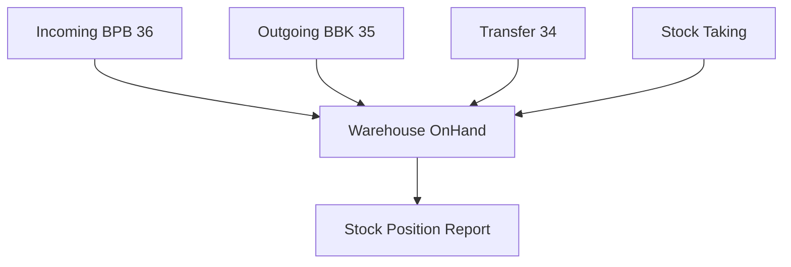
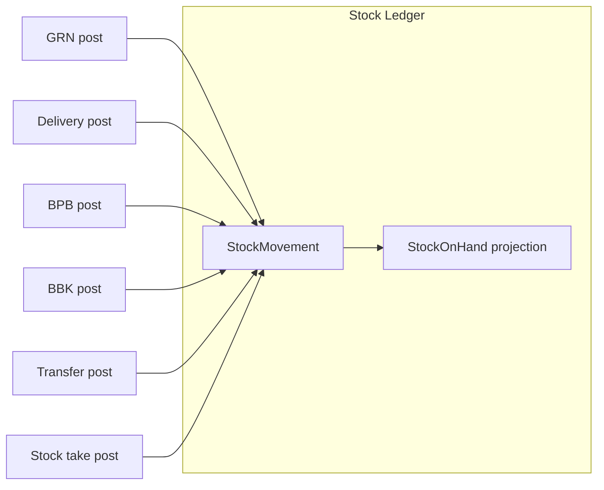
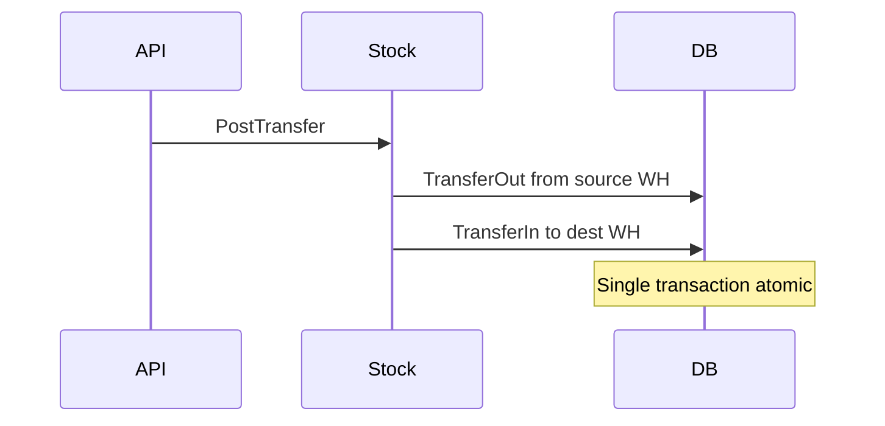

# Inventory Flow — End to End

**Legacy reference:** `Jaza Venus Legacy Program/docs/07-flow-inventory.md`, `docs/business-flows/04-inventory-transaction.md`

**New app routes:** `/inventory/*`  
**Backend:** `StockController`, stock entities in `Jaza.Domain.Stock`

---

## 1. Overview

Inventory operations beyond purchase/sales delivery:



**Warehouse types:** Utama (main), Kanvas (canvas), Konsinyasi (consignment), Field Promo.

---

## 2. Stock ledger model



| Movement type | Direction | Source |
|---------------|-----------|--------|
| GoodsReceipt | IN | GRN, Return |
| GoodsIssue | OUT | Delivery, PR |
| AdjustmentIn | IN | BPB |
| AdjustmentOut | OUT | BBK |
| TransferIn/Out | IN/OUT | Inter-warehouse |
| StockTakeIn/Out | IN/OUT | Opname variance |

---

## 3. Available quantity

```
available = on_hand − committed
```

Committed increased on Sales Order post; released on Delivery post.

---

## 4. Inter-warehouse transfer



---

## 5. Stock taking

1. **Preparation:** Snapshot expected qty per SKU/warehouse.
2. **Record:** Enter actual count; compute variance.
3. **Post:** Adjustment movements for variance.

---

## 6. Implementation status

| Feature | Backend | Frontend |
|---------|---------|----------|
| Stock on-hand query | ✅ | Dashboard partial |
| Manual adjustment | ✅ Admin | ❌ |
| BPB document | ❌ | UI shell |
| BBK document | ❌ | UI shell |
| Transfer | ❌ | UI shell |
| Stock taking | ❌ | UI shell |
| Planning | ❌ | UI shell |

See [PRDs](../../prds/inventory/).
