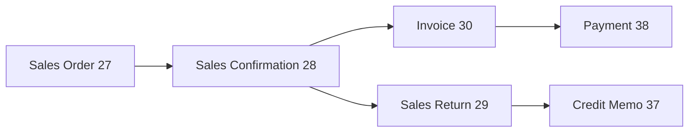
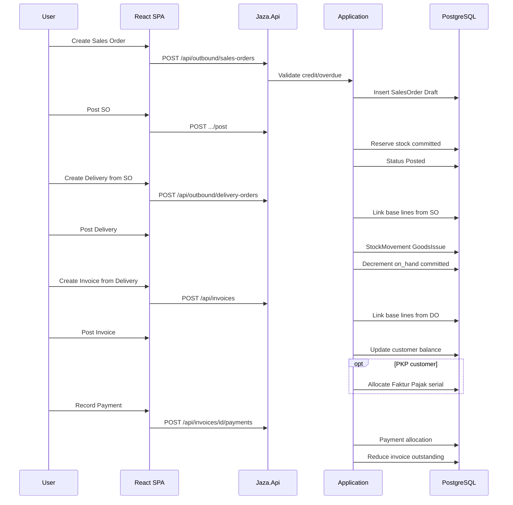
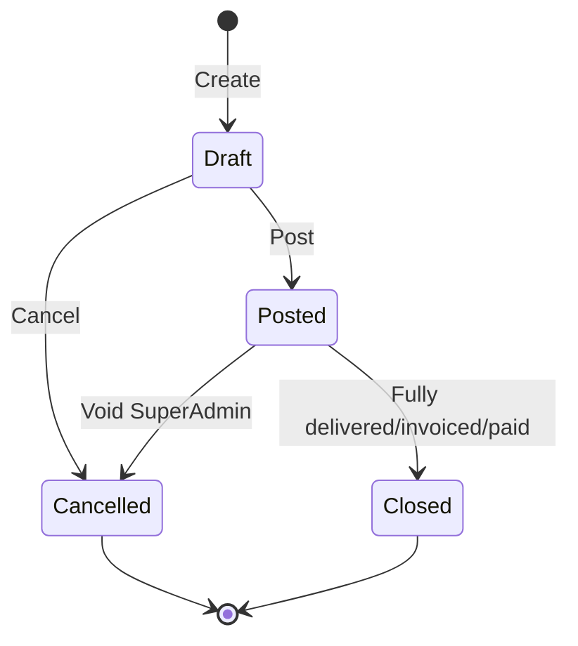

# Sales Flow — End to End

**Legacy reference:** `Jaza Venus Legacy Program/docs/06-flow-sales-ar.md`, `docs/business-flows/02-sales-transaction.md`

**New app routes:** `/sales/*`  
**Backend:** `OutboundController`, `InvoicingController`, `StockController`

---

## 1. Overview

The sales cycle follows a strict document chain. Each downstream document references its source via `base_type`, `base_entry`, `base_line`.



---

## 2. Sequence: Order to Payment



---

## 3. Document state machine



| Status | Code | Editable | Referenceable |
|--------|------|----------|---------------|
| Draft | — | Yes | No |
| Open | O | Limited | Yes |
| Cancelled | B | No | No |
| Closed | C | No | No (historical) |

---

## 4. Credit control gates

| Stage | Balance checked | Legacy function |
|-------|----------------|-----------------|
| Sales Order | OrdersBal | CheckCreditLimit |
| Sales Confirmation | DNotesBal | CheckCreditLimit |
| Invoice | Balance | CheckCreditLimit |

**Rule:** `credit_limit > current_balance + new_total` else block. SuperAdmin can override (legacy F6).

---

## 5. Stock impact

| Event | on_hand | committed |
|-------|---------|-----------|
| SO post | — | +qty |
| SO cancel | — | −qty |
| Delivery post | −qty | −qty |
| Return post | +qty | — |

**Available qty:** `on_hand − committed`

---

## 6. Discount calculation

```
LineTotal = Qty × Price × (1 − P1/100) × (1 − P2/100)
P3FreeGoods = (Qty / GiftLimit) × TotalGift
HeaderTotal = Σ LineTotals − ExtraDiscount% − P3 value
Tax = (HeaderTotal − ExtraDisc) × VAT%
```

---

## 7. New app implementation status

| Step | Backend | Frontend | Business rules |
|------|---------|----------|----------------|
| Sales Order | ✅ | ❌ not wired | ❌ credit/stock |
| Sales Confirmation | ✅ | ❌ not wired | ❌ credit |
| Invoice | ✅ | ❌ not wired | ❌ Faktur serial |
| Payment | ✅ | ❌ not wired | Partial |
| Sales Return | ✅ schema | UI shell | ❌ |
| Credit Memo | ✅ schema | ❌ | ❌ |

Persisted entities: [table-catalog](../../database/table-catalog.md). See [parity matrix](../../parity/legacy-to-new-parity-matrix.md) and transaction PRDs in [prds/transactions/](../../prds/transactions/).

---

## Related

- [Purchase flow](../purchase/overview.md)
- [A/R flow](../ar/overview.md)
- [PRD: Sales Order](../../prds/transactions/sales-order.md)
- [Table catalog](../../database/table-catalog.md)
