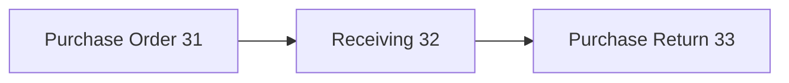
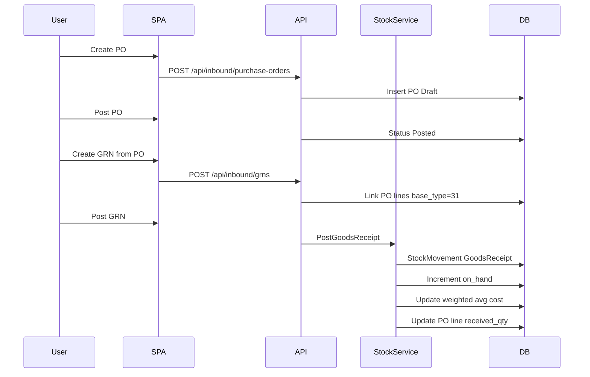

# Purchase Flow — End to End

**Legacy reference:** `Jaza Venus Legacy Program/docs/05-flow-purchasing.md`, `docs/business-flows/01-purchase-transaction.md`

**New app routes:** `/purchase/*`  
**Backend:** `InboundController`, `StockController`

---

## 1. Overview

Purchase receives stock IN. Returns stock OUT to supplier.

---

## 2. Sequence: PO to GRN

---

## 3. Document state machine

Same pattern as sales: Draft → Posted → Closed/Cancelled.

Partial receiving: PO stays Open until all lines fully received.

---

## 4. Business rules

1. GRN qty ≤ PO qty − already received.
2. On GRN post: stock IN; cost updated (weighted average).
3. Purchase return: stock OUT; link to PO or GRN.
4. Supplier payment terms apply to PO header.

---

## 5. Implementation status

| Step | Backend | Frontend |
|------|---------|----------|
| Purchase Order | ✅ | ❌ not wired |
| Receiving (GRN) | ✅ | ❌ (`GrnsPage` exists, not routed) |
| Purchase Return | ✅ schema | UI shell |

Persisted entities: [table-catalog](../../../database/table-catalog.md). See [PRDs](../prds/).
