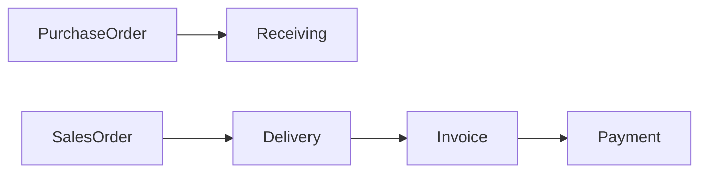
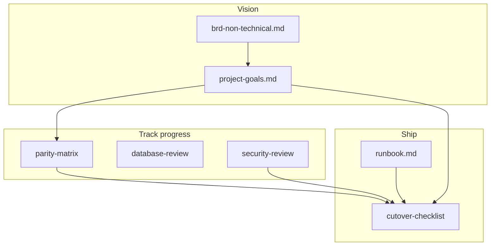

# Jaza Venus — Project Goals

**Audience:** Product, engineering, deployment stakeholders  
**Purpose:** Single consolidated view of *why* Jaza Venus exists and *what* must be true before production cutover.  
**Related:** [brds/brd-non-technical.md](brds/brd-non-technical.md) (business vision), [brds/brd-parity-and-changes.md](brds/brd-parity-and-changes.md) (engineering truth), [parity/legacy-to-new-parity-matrix.md](parity/legacy-to-new-parity-matrix.md) (live scoreboard).

---

## North star

Replace the legacy VB6 **Sales Inventory System** (Windows XP + SQL Server) with **Jaza Venus** — a modern web ERP that:

1. Preserves daily business workflows and legacy screen labels.
2. Fixes security, maintainability, and known pain points.
3. Cuts over to production **without losing data or business rules**.

---

## 1. Problem statement

| Pain | Who is affected | Severity |
|------|-----------------|----------|
| Application on unsupported Windows XP | All staff | Critical |
| Unmaintainable VB + old SQL Server stack | IT / Developer | Critical |
| Invoice creation takes 3 steps; revisions repeat all 3 | Sales / Finance | High |
| No audit trail | SuperAdmin / Management | High |
| No role-based access | Management | Medium |
| Single language only | Non-English staff | Medium |
| Large history with no archiving | All users | Medium |
| No error monitoring | Developer | Low |

Source: [brds/brd-non-technical.md](brds/brd-non-technical.md) §2.

---

## 2. Primary business goals (must-have)

| ID | Goal | Verification |
|----|------|--------------|
| **G1** | **Full feature migration** — every legacy feature available in the new app | [parity matrix](parity/legacy-to-new-parity-matrix.md) shows no required gaps |
| **G2** | **Zero workflow breakage** — same business flows; legacy labels/menus preserved | UAT + [use cases](use-cases/overview.md) |
| **G3** | **Fast and secure** — faster than desktop; modern web security | [security/security-review.md](security/security-review.md), [performance/performance-guide.md](performance/performance-guide.md) |
| **G4** | **Complete data migration** — all legacy SQL Server records intact | [schema-mapping.md](schema-mapping.md), [migration-howto.md](migration-howto.md), ETL reconciliation |
| **G5** | **Production cutover** — go-live with trained staff | [cutover-checklist.md](cutover-checklist.md), [training-signoff.md](training-signoff.md) |

---

## 3. Improvement goals (deliberate changes vs legacy)

| ID | Goal | Legacy → New |
|----|------|--------------|
| **I1** | Maintainable stack (10+ year horizon) | VB6 → .NET 10 + React 19 + PostgreSQL |
| **I2** | Invoice simplified | 3 steps → **1 step** (create + revise) |
| **I3** | Role-based access | Developer / SuperAdmin / Admin / Sales with module + report permissions — [modules/auth/](modules/auth/) |
| **I4** | Full audit trail | Every create/edit/delete logged — [database/audit-and-history.md](database/audit-and-history.md) |
| **I5** | Localization | Bahasa Indonesia + English — [modules/shared/localization/i18n-framework.md](modules/shared/localization/i18n-framework.md) |
| **I6** | 5-year active data policy | Older data archived, still queryable |
| **I7** | Web access | Browser on any device vs Windows XP desktop only |
| **I8** | Developer error monitoring | Error log page (Developer-only) — [modules/system/](modules/system/) |

---

## 4. Functional scope goals

Organized by the navigation tree in `frontend/src/app/modules.tsx` and PRDs under [modules/README.md](modules/README.md).

### Master Maintenance

Customer + outlet classifications; product + classifications; supplier/principle; bank; tax registration; payment terms; cost types; extra discount; order/return codes; item pricing; BP item; penetration.

### Purchase

Purchase Order, Receiving Entry (GRN), Purchase Return.

### Sales

Sales Order, Sales Confirmation (delivery), Sales Return, Invoicing Process, Credit Memo.

### Inventory

Incoming BPB, Outgoing BBK, Inter-warehouse transfer, Stock taking (prep + record), Inventory planning.

### A/R

Payment receipt, Bank transfer, PDC clearance + cancellation, AR adjustment, Closing AR, Recalculate AR balance.

### Reports

~90+ legacy reports → SQL/API + React (Crystal Reports replacement) per [modules/reports/prds/report-catalog.md](modules/reports/prds/report-catalog.md).

### System

Auth (login, MFA, password), user/permission management, preferences, audit history, error logs, period-end, backup/restore, delete cancelled documents.

### Cross-cutting UI foundation

Shared lookup dialog, legacy F-key toolbar, editable line grid, dialog patterns — [modules/shared/ui-foundation/](modules/shared/ui-foundation/).

---

## 5. Business rules that must not break

Non-negotiable parity from [brds/brd-parity-and-changes.md](brds/brd-parity-and-changes.md) §2:

| Rule | Must preserve |
|------|----------------|
| Document chain | Order → Delivery → Invoice → Payment |
| Discounts | P1 product, P2 extra/customer, P3 free goods |
| Credit control | Plafond at SO/Delivery/Invoice + admin override |
| Overdue blocking | Past-due invoices block + override |
| Stock | OnHand, Committed, Available = OnHand − Committed |
| Tax | Faktur Pajak serial from TaxNo pool (PKP customers) |
| Payments | Cash, Transfer, Check/Giro, Others, Return, Adjustment |
| Division scoping | Users see only their division data |
| Document status | Open / Cancelled / Closed |

Tracked per feature in [parity/legacy-to-new-parity-matrix.md](parity/legacy-to-new-parity-matrix.md).

---

## 6. Documentation goals

| Goal | Document |
|------|----------|
| Feature parity tracking | [parity/legacy-to-new-parity-matrix.md](parity/legacy-to-new-parity-matrix.md) |
| BRD reconciliation | [brds/brd-parity-and-changes.md](brds/brd-parity-and-changes.md) |
| Database architecture verdict | [database/database-review.md](database/database-review.md) |
| Security pre-go-live audit | [security/security-review.md](security/security-review.md) |
| Performance guidance | [performance/performance-guide.md](performance/performance-guide.md) |
| End-to-end flows | [modules/](modules/) `*/flow/` |
| Actor use cases | [use-cases/overview.md](use-cases/overview.md) |
| API reference suite | [api/README.md](api/README.md) |

---

## 7. Migration and discovery goals

| Goal | Document |
|------|----------|
| Phase 0: capture all legacy behavior | [discovery-checklist.md](discovery-checklist.md) |
| Legacy schema extract | [legacy-schema-extract.sql](legacy-schema-extract.sql) |
| Table/entity mapping for ETL | [schema-mapping.md](schema-mapping.md) |
| Run ETL console | [migration-howto.md](migration-howto.md) (`Jaza.Migration`) |

---

## 8. Deployment and operations goals

| Goal | Document |
|------|----------|
| Staging / production deploy | [deploy/fly-runbook.md](deploy/fly-runbook.md), [deployment-hosting.md](deployment-hosting.md) |
| Backup, restore, rollback | [runbook.md](runbook.md) |
| Go-live checklist | [cutover-checklist.md](cutover-checklist.md) |
| Secrets not in repository | [security/security-review.md](security/security-review.md) (CRIT-01) |

**Staging (current):** Frontend — [jazavenus.vercel.app](https://jazavenus.vercel.app); API — [jaza-venus.fly.dev](https://jaza-venus.fly.dev).

---

## 9. Phased delivery goals

From [brds/brd-parity-and-changes.md](brds/brd-parity-and-changes.md) §5:

| Phase | Goal |
|-------|------|
| **Phase 1 — MVP cutover** | Daily ops: master data + PO→GRN→SO→DO→Invoice→Payment; wire UIs; credit/overdue; stock commit; Faktur Pajak; top reports; ETL |
| **Phase 2 — Full transaction parity** | Returns, credit memo, BPB/BBK/transfer, stock take, PDC/bank batch, closing AR, extra discount, 15–20 core reports |
| **Phase 3 — Automation** | Auto order/delivery/invoice jobs, B2B integrations (Semblog/Clipper), remaining 70+ reports, multi-company, consignment |

**Live progress:** Use the [parity matrix](parity/legacy-to-new-parity-matrix.md) and [docs/README.md](README.md) deployment-readiness section — not this document — for current Implemented/Partial/Missing counts.

---

## 10. Success metrics

From [brds/brd-non-technical.md](brds/brd-non-technical.md) §9:

- 100% of legacy features available in the new system
- All legacy data migrated with zero loss
- Invoice processing time reduced by 60%+ (3 steps → 1 step)
- All 35–50 staff can log in and complete daily tasks
- Training time under 1 hour per person
- Page load under 2 seconds on a 10 Mbps connection
- Audit trail captures 100% of write actions
- System available in Bahasa Indonesia and English
- No security breaches in the first 12 months

---

## 11. Future goals (out of MVP scope)

- Offline-capable design — [offline-architecture.md](offline-architecture.md)
- Phase 3 automation and external integrations — [brds/brd-parity-and-changes.md](brds/brd-parity-and-changes.md) §5

---

## 12. Goal → document map (quick reference)

